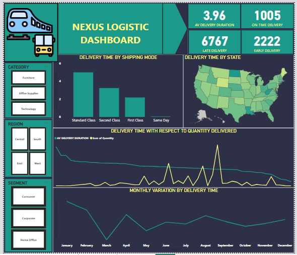

### ABOUT ME
Hello! I’m Haruna Ademoye 😊, a data analyst, and Machine Learning Specialist with a passion for learning, and turning data into actionable insights. With experience across healthcare, finance, sales, operations, and customer service, I support businesses in solving challenges to unlock growth.

# THIS IS WHAT I DO
*As a data analyst of Olalekan Ademoye & Co., I provide stakeholders data driven insights to support decisions for the clients, analyze staff payrolls, and manage their data storage system.*

**- ✅ Data Analysis_**
I provide in-depth analysis and tailored solutions to help you make data driven decisions to stay ahead the competitors. 

**- ✅ Data Management_**
I collect and extract data from various sources such as pdf, invoices, bank statement to identify meaningful insights, anonymize personal data for privacy, ensure data integrity, and conduct metadata for effective data storage.

### MY PORTFOLIO

# *Glimpse of the project I've been working on.* 

*Insights for prevalence of foodborne diseases *

*Insights for attrition*

*Insights for logistic “delivery efficiency.*

*Insights for promotion or demotion.*

*insights for revenue, expenses, and overall profitability-etuk challenge.*

*insights for demographic of people that are more likely to have stroke.*

*Exploratory Data Analysis and Predictive model that predict if a persons income exceed $50k.
*

<a href = “How to present Data to Executives by Haruna Ademoye.pdf”> Download the report here (pfd file)</a>

### REACH OUT TO ME
 
*Let’s connect and see how we can make a difference!* 
<table> 
 <tbody> 
 <tr> 
 <td><svg width="16" height="16" viewBox="0 0 24 24" fill="#007bff">
  <path d="M20 4H4c-1.1 0-1.99.9-1.99 2L2 18c0 1.1.9 2 2 2h16c1.1 0 2-.9 2-2V6c0-1.1-.9-2-2-2zm0 4l-8 5-8-5V6l8 5 8-5v2z"/>
 </svg></td>
 <a href="mailto:ademoyeharuna@gmail.com">ademoyeharuna@gmail.com</a></td> 
 </tr>  
 </tbody> 
</table> 
