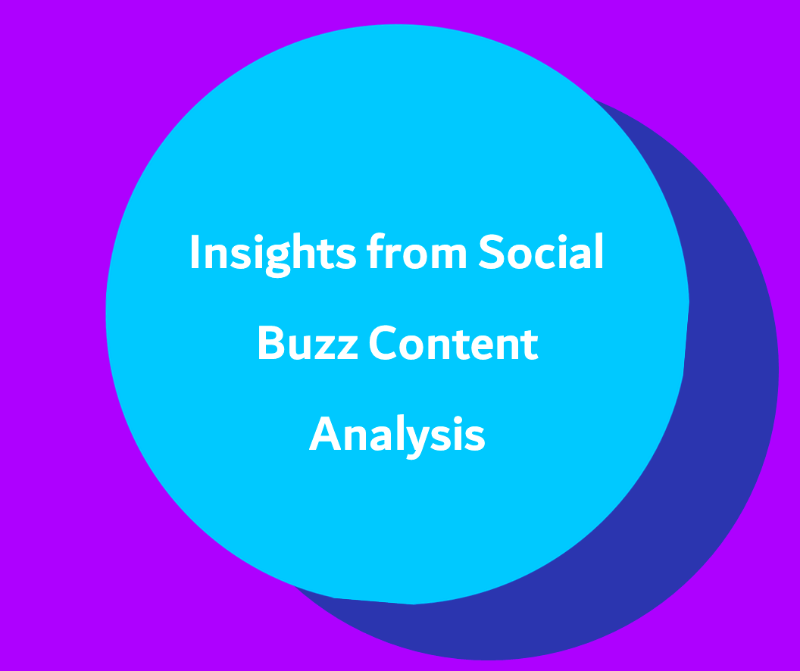

# ABOUT ME
Hello! I’m Haruna Ademoye 😊, a data analyst, and Machine Learning Specialist with a passion for learning, and turning data into actionable insights. With experience across healthcare, finance, sales, operations, and customer service, I support businesses in solving challenges to unlock growth.

## THIS IS WHAT I DO
*As a data analyst of Olalekan Ademoye & Co., I provide stakeholders data driven insights to support decisions for the clients, analyze staff payrolls, and manage their data storage system.*

**- ✅ Data Analysis_**
I provide in-depth analysis and tailored solutions to help you make data driven decisions to stay ahead the competitors. 

**- ✅ Data Management_**
I collect and extract data from various sources such as pdf, invoices, bank statement to identify meaningful insights, anonymize personal data for privacy, ensure data integrity, and conduct metadata for effective data storage.

# MY PORTFOLIO

## *Glimpse of the project I've been working on.* 

*Exploratory Data Analysis to gain Insights for "Sexual Transmitted Diseases".*

*Profit & Loss Analysis to gain insights for "revenue, expenses, and overall profitability"- Anietie etuk challenge*
<a href="https://www.linkedin.com/posts/haruna-ademoye-859486110_overview-of-the-analysis">**Read More**</a>*

*Exploratory Data Analysis to gain Insights for "Attrition"*

*Exploratory Data Analysis to gain Insights for "promotion & demotion".*

*Exploratory Data Analysis to gain "Insights for Sexual Transmitted Disease".
*

*Exploratory Data Analysis to gain Insights for "prevalence of foodborne diseases"*

*Key performances Indicator(KPI) analysis to provide insights for "staeholders" - Maven Analytics Heathcare challenge
<a href="https://www.linkedin.com/posts/haruna-ademoye-859486110_mavenhospitalchallenge-activity-7217329038401409025-1y6P?utm_source=share&utm_medium=member_desktop">**Read More**</a>*

*Exploratory Data Analysis and Predictive model that predict if a persons income exceed $50k.
*
*

*Analysis of Social Buzz content to identify top 10 categories of contents for the stakeholders"- Accenture Job Simulation Project
<a href="https://drive.google.com/file/d/18yHTEj0MnJpIFaMtrddvYyFdk0fB90qa/view?usp=sharing">**Here is 10minutes presentation slides**</a>*
*

# REACH OUT TO ME
 
*Let’s connect and see how we can make a difference!* 

<table>
  <tbody>
    <tr><td>
      </td><td>
 <a href="ademoyeharuna@gmail.com"> Ademoyeharuna@gmail.com</a>
      </td></tr>
   
 <tr><td>
 
 </td><td>
  <a href="tel:+2348074904427"> +234 8074 904 427</a>
      </td> </tr>
      
<tr> <td>  </td>
      <td> <a href="https://github.com/HARDECOMM"> Github</a>
      </td></tr>
      
 <tr><td>
    </td><td> <a href="https://medium.com/@ademoyeharuna"> Medium</a>
      </td></tr>
      
<tr> <td>
 </td>
      <td>
<a href="https://maps.app.goo.gl/FwoJcSH7JaN1LW4Q8"> Lagos, Nigeria</a>
      </td> </tr> 

<tr> <td>
 </td>
      <td>
<a href="https://www.dropbox.com/scl/fi/eo359e09hj90jrv1vrd7o/HARUNA-ADEMOYE-A_CV_org.pdf?rlkey=6jz27oaucp6ztrqinxjcswnjt&st=5qz9ypjr&dl=0">Download My CV</a>
      </td> </tr> 
  
  <tr> <td>
 </td>
      <td><a href="https://www.linkedin.com/in/haruna-ademoye-859486110?utm_source=share&utm_campaign=share_via&utm_content=profile&utm_medium=android_app)"> LinkedIn</a>
      </td> </tr> 
  
  </tbody>
</table>
