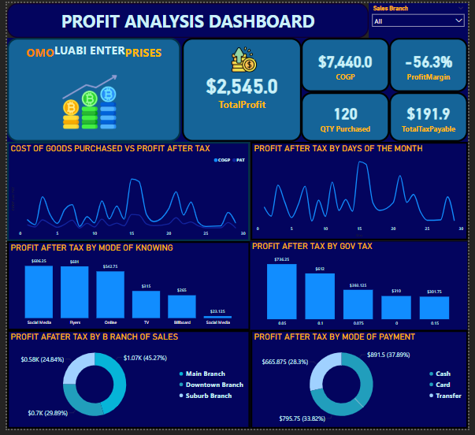

## ABOUT ME
Hello! I’m Haruna Ademoye 😊, a data analyst, and Machine Learning Specialist with a passion for learning, and turning data into actionable insights. With experience across healthcare, finance, sales, operations, and customer service, I support businesses in solving challenges to unlock growth.

## THIS IS WHAT I DO
*As a data analyst of Olalekan Ademoye & Co., I provide stakeholders data driven insights to support decisions for the clients, analyze staff payrolls, and manage their data storage system.*

**- ✅ Data Analysis_**
I provide in-depth analysis and tailored solutions to help you make data driven decisions to stay ahead the competitors. 

**- ✅ Data Management_**
I collect and extract data from various sources such as pdf, invoices, bank statement to identify meaningful insights, anonymize personal data for privacy, ensure data integrity, and conduct metadata for effective data storage.

### *Glimpse of the project I've been working on.* 

*Exploratory Data Analysis and Predictive model that predict if a persons income exceed $50k.

*AnalysisAnalysis of stroke dataset to give an insight on demographic of people who are more likely to have stroke.*

*Analysis of stroke dataset to give an insight on demographic of people who are more likely to have stroke.*

*Analysis of Employee dataset to identify why people are leaving the company.*

*Analysis of shipping dataset to improve inform decision about “delivery efficiency.*

*Analysis of employee sales data to inform decision about promotion or demotion.*

*Analysis of sales data to understand profit making.*

*Analysis of profit and loss datasets to understand revenue, expenses, and overall profitability-etuk challenge.*

*Analysis of healthcare dataset to duration of people l *Maven Analytics Challenge**. Using Business Intelligence Analysis Tools.*

<a href = “How to present Data to Executives by Haruna Ademoye.pdf”> Download the report here (pfd file)</a>

## REACH OUT TO ME HERE
 
*Let’s connect and see how we can make a difference!* 
<table> 
 <tbody> 
 <tr> 
 <td>`<svg xmlns="(link unavailable)" viewBox="0 0 24 24"><path d="M20 4H4c-1.1 0-1.99.9-1.99 2L2 18c0 1.1.9 2 2 2h16c1.1 0 2-.9 2-2V6c0-1.1-.9-2-2-2zm0 4l-8 5-8-5V6l8 5 8-5v2z"/></svg> </td> 
 <td><a 
href="mailto:ademoyeharuna@gmail.com">ademoyeharuna@gmail.com</a></td> 
 </tr> 
 <tr> 
 <td>궭궮</td> 
 <td>(234) 807-490-4427</td> 
 </tr> 
 <tr> 
 <td>굗굙굘</td> 
 <td>Lagos, Nigeria</td> 
 </tr> 
 <tr> 
 <td>脥</td> 
 <td><a 
href="https://etuk123456.github.io/portfolio1/docs/Profile.pdf">Download my 
CV</a></td> 
 </tr> 
 <tr> 
 <td>舏</td> 
 <td><a href="https://linkedin.com/in/etukanietie">The things I do daily 
on LinkedIn</a></td> 
 </tr> 
 <tr> 
 <td>긼긽긾깂긿깃깄김깁</td> 
 <td><a href="https://www.youtube.com/@LearnwithEtuk">Watch my tutorials 
on YouTube</a></td> 
 </tr> 
 </tbody> 
</table> 

- Gmail: `<svg xmlns="(link unavailable)" viewBox="0 0 24 24"><path d="M20 4H4c-1.1 0-1.99.9-1.99 2L2 18c0 1.1.9 2 2 2h16c1.1 0 2-.9 2-2V6c0-1.1-.9-2-2-2zm0 4l-8 5-8-5V6l8 5 8-5v2z"/></svg>`
- Call: `<svg xmlns="(link unavailable)" viewBox="0 0 24 24"><path d="M20 12v8h-8v-8h-2v6l4-4-4-4v6h2z"/></svg>`
- Dropdown: `<svg xmlns="(link unavailable)" viewBox="0 0 24 24"><path d="M7 10l5 5 5-5z"/><path d="M0 0h24v24H0z" fill="none"/></svg>`
- Location: `<svg xmlns="(link unavailable)" viewBox="0 0 24 24"><path d="M12 2C8.13 2 5 5.13 5 9c0 5.25 7 13 7 13s7-7.75 7-13c0-3.87-3.13-7-7-7zm0 9.34l-1.39-1.39-3.62 3.63 1.39 1.39 3.62-3.63z"/></svg>`
